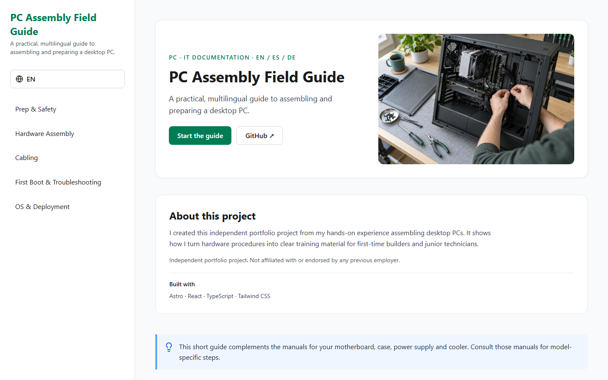

# PC Assembly Field Guide

A concise, multilingual PC assembly guide for first-time builders and junior technicians. I created it as an independent portfolio project inspired by my hands-on experience assembling desktop PCs: it demonstrates both practical hardware knowledge and the ability to turn technical work into clear training documentation.

**[Open the guide](https://pc-assembly-standard.vercel.app/en/)** · [Español](https://pc-assembly-standard.vercel.app/es/) · [Deutsch](https://pc-assembly-standard.vercel.app/de/)



[View the mobile preview](docs/guide-mobile.png).

## What it covers

- Preparation and ESD precautions
- CPU, cooler, RAM, motherboard and GPU installation
- Front-panel, power, fan and lighting connections
- First boot, firmware settings and basic troubleshooting
- Operating-system installation and driver setup

Each section includes an interactive checklist. Progress is stored locally in the browser and shared across the three languages. The guide is deliberately compact; it does **not** replace the manuals for the exact motherboard, case, power supply, cooler or other components.

## Built with

Astro, React, TypeScript and Tailwind CSS. Astro renders the guide as static pages; React is used only for the interactive checklists. The interface includes keyboard-accessible navigation, a skip link, localized controls, responsive layouts and reduced-motion support.

## Run locally

Requires a current Node.js release compatible with Astro 7 (Node 22.12 or later).

```bash
git clone https://github.com/sergioiglesiasleite/pc-assembly-standard.git
cd pc-assembly-standard
npm ci
npm run dev
```

Useful commands:

```bash
npm run check       # Astro and TypeScript checks
npm run test        # Content and checklist-storage tests
npm run build       # Production build
npx playwright install chromium
npm run test:e2e    # Browser and accessibility smoke tests
```

The repository includes a GitHub Actions workflow that runs checks, unit tests, the build and browser tests on pushes and pull requests. The static site is hosted on Vercel. No account, backend, analytics or cookies are required; checklist state stays in the visitor's browser.

## Project structure

- `src/data/`: localized guide content, source references and stable checklist IDs
- `src/components/`: reusable guide sections, illustrations, navigation and checklist controls
- `src/pages/`: language routes and sitemap
- `public/images/`: optimized illustrations and social preview
- `tests/` and `e2e/`: content, storage, browser and accessibility checks
- `docs/`: technical review, baseline and quality-check notes

## Content and maintenance

Guide text lives in [`src/data/translations.ts`](src/data/translations.ts). Checklist IDs are language-independent and versioned in [`src/data/checklistIds.ts`](src/data/checklistIds.ts) and [`src/data/checklistStorage.ts`](src/data/checklistStorage.ts). Editing the order of checklist items does not move a user's checkmark to another task. The earlier index-based storage format is not imported, because changed text and order would make that migration unreliable; existing progress from the old site starts fresh.

Technical decisions, review date and official reference links are documented in [`docs/TECHNICAL-REVIEW.md`](docs/TECHNICAL-REVIEW.md) and displayed in the guide. Content should be rechecked when hardware standards or operating-system requirements change. The German copy has not had a native-speaker review and should receive one before being presented as professional-level German technical writing.

The five retained component illustrations came from earlier AI-generated project artwork and were optimized as WebP. Six potentially misleading diagrams were replaced with explicitly schematic SVGs that avoid pretending to show a model-specific pinout. The new hero image was generated for this project and optimized as WebP. These visuals support the text; they are not substitutes for a manufacturer's diagram. No previous employer's internal material, branding or documentation is used.

## Portfolio context

This is a personal, independent project. It is not affiliated with or endorsed by any previous employer. The goal is to show how hardware assembly experience can be translated into approachable, multilingual training content—not to claim the guide is a full certification or an official assembly standard.

No open-source license has been selected yet. Please request permission before reusing the code or assets outside this repository.

## Next improvements

Seek a native-speaker review of the German text and periodically recheck the hardware guidance against current manufacturer documentation. Broader features such as offline mode or PDF export are intentionally outside this compact guide's scope.
